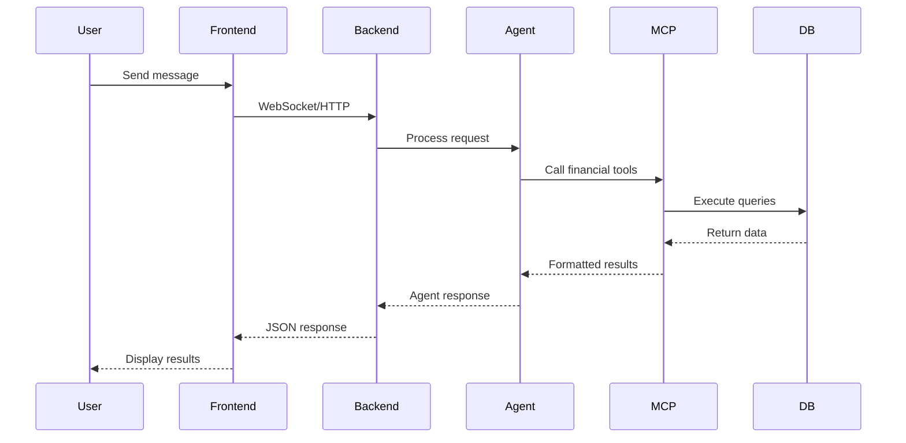
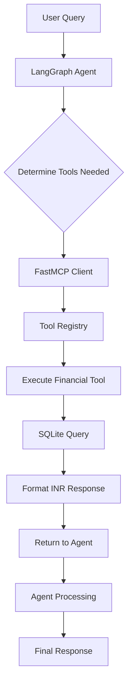
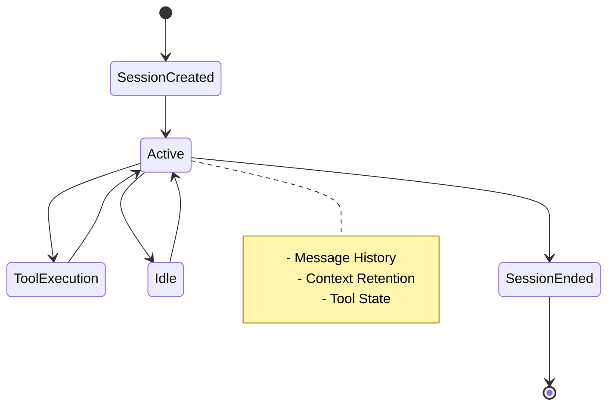

# FinanceBud Architecture

Comprehensive technical documentation for the FinanceBud AI Financial Analysis Platform.

## 🏗️ System Overview

FinanceBud is a modern financial analysis platform built with a microservices-inspired architecture that combines FastMCP protocol integration, LangGraph AI agents, and local LLM processing. The system emphasizes privacy, performance, and extensibility.

### Core Design Principles

1. **Privacy First**: All processing happens locally with no external API calls
2. **Modular Architecture**: Clean separation between web interface, API, agents, and MCP services
3. **Protocol Standards**: Full FastMCP 2.11.0 compliance for tool discovery and execution
4. **Async Everything**: Non-blocking operations throughout the stack
5. **Type Safety**: Comprehensive Pydantic models and type hints

## 📊 Architecture Diagram

```
┌─────────────────────────────────────────────────────────────────┐
│                        FinanceBud Platform                       │
├─────────────────────────────────────────────────────────────────┤
│                                                                 │
│  ┌─────────────────┐    ┌──────────────────┐    ┌─────────────┐ │
│  │   Web Client    │    │   FastAPI        │    │ LM Studio   │ │
│  │   (Frontend)    │◄──►│   Backend        │◄──►│ (Local AI)  │ │
│  │                 │    │                  │    │             │ │
│  │ • React/JS      │    │ • WebSocket      │    │ • Llama 3.2 │ │
│  │ • WebSocket     │    │ • REST API       │    │ • Local GPU │ │
│  │ • Responsive    │    │ • Session Mgmt   │    │ • Privacy   │ │
│  └─────────────────┘    └──────────────────┘    └─────────────┘ │
│                                   │                             │
│                                   ▼                             │
│                         ┌──────────────────┐                    │
│                         │  LangGraph Agent │                    │
│                         │                  │                    │
│                         │ • State Machine  │                    │
│                         │ • Tool Router    │                    │
│                         │ • Context Mgmt   │                    │
│                         │ • Error Handling │                    │
│                         └──────────────────┘                    │
│                                   │                             │
│                                   ▼                             │
│                         ┌──────────────────┐                    │
│                         │  FastMCP Client  │                    │
│                         │                  │                    │
│                         │ • Protocol 2.11  │                    │
│                         │ • Auto Discovery │                    │
│                         │ • Tool Registry  │                    │
│                         │ • Type Safety    │                    │
│                         └──────────────────┘                    │
│                                   │                             │
│                                   ▼                             │
│                         ┌──────────────────┐                    │
│                         │   MCP Server     │                    │
│                         │                  │                    │
│                         │ • 6 Financial    │                    │
│                         │   Tools          │                    │
│                         │ • INR Support    │                    │
│                         │ • UPI Analysis   │                    │
│                         └──────────────────┘                    │
│                                   │                             │
│                                   ▼                             │
│                         ┌──────────────────┐                    │
│                         │ SQLite Database  │                    │
│                         │                  │                    │
│                         │ • 5,657 Txns     │                    │
│                         │ • 2023-2025      │                    │
│                         │ • ₹40,650.11     │                    │
│                         │ • Optimized      │                    │
│                         └──────────────────┘                    │
│                                                                 │
└─────────────────────────────────────────────────────────────────┘
```

## 🔧 Technology Stack

### Frontend Layer
- **HTML5/CSS3/JavaScript**: Modern web standards with responsive design
- **WebSocket API**: Real-time bidirectional communication
- **Fetch API**: RESTful API interactions
- **No Framework Dependencies**: Lightweight and fast

### Backend Layer
- **FastAPI 0.104.0+**: High-performance async web framework
- **Uvicorn**: ASGI server with hot reload capabilities
- **WebSockets**: Real-time communication protocol
- **Pydantic**: Data validation and serialization

### AI/Agent Layer
- **LangGraph 0.2.0+**: State machine-based agent orchestration
- **LangChain Core**: Foundation for LLM integration
- **LM Studio Integration**: Local LLM hosting and inference
- **Custom Agent Logic**: Financial domain-specific reasoning

### MCP Layer
- **FastMCP 2.11.0**: Modern MCP client/server implementation
- **Protocol Compliance**: Full MCP specification adherence
- **Auto Tool Discovery**: Dynamic tool registration and execution
- **Type-Safe Communication**: Structured data exchange

### Data Layer
- **SQLite**: Embedded database with ACID compliance
- **Optimized Schemas**: Indexed tables for fast queries
- **Connection Pooling**: Efficient database resource management
- **Backup Strategy**: Automated database backup system

## 📁 Detailed Component Architecture

### 1. Frontend Architecture (`frontend/index.html`)

```javascript
// Core Components
├── UI Manager
│   ├── Chat Interface
│   ├── Settings Panel
│   ├── Quick Actions
│   └── Response Display
│
├── Communication Layer
│   ├── WebSocket Handler
│   ├── HTTP Client
│   ├── Session Manager
│   └── Error Handler
│
└── State Management
    ├── Message History
    ├── Connection Status
    ├── User Preferences
    └── Cache Manager
```

**Key Features:**
- **Responsive Design**: Mobile-first approach with CSS Grid/Flexbox
- **Real-time Updates**: WebSocket for instant responses
- **Progressive Enhancement**: Graceful fallback to HTTP if WebSocket fails
- **Session Persistence**: Client-side session management

### 2. Backend Architecture (`backend/`)

#### Main Application (`backend/main.py`)

```python
# FastAPI Application Structure
├── Application Factory
│   ├── CORS Configuration
│   ├── Middleware Setup
│   ├── Exception Handlers
│   └── Startup/Shutdown Events
│
├── API Routes
│   ├── /health - Health check endpoint
│   ├── /chat - Synchronous chat endpoint
│   ├── /ws/{session_id} - WebSocket endpoint
│   ├── /sessions/{session_id}/history - Chat history
│   ├── /servers - Available MCP tools
│   └── /metrics - System metrics
│
├── WebSocket Manager
│   ├── Connection Pool
│   ├── Session Isolation
│   ├── Message Broadcasting
│   └── Cleanup Logic
│
└── Integration Layer
    ├── LangGraph Agent Interface
    ├── FastMCP Client Management
    ├── Session Storage
    └── Error Propagation
```

**Key Features:**
- **Async/Await**: Non-blocking operations throughout
- **Session Management**: Isolated user sessions with memory
- **Health Monitoring**: Comprehensive health checks
- **Auto-Documentation**: OpenAPI/Swagger integration

#### Agent System (`backend/agents/financial_agent.py`)

```python
# LangGraph Agent Architecture
├── State Definition
│   ├── AgentState (TypedDict)
│   ├── Message History
│   ├── Tool Results
│   └── Session Context
│
├── Node Functions
│   ├── chat_node() - LLM interaction
│   ├── tool_node() - Tool execution
│   ├── should_continue() - Routing logic
│   └── error_handler() - Error recovery
│
├── Graph Construction
│   ├── StateGraph Definition
│   ├── Node Registration
│   ├── Edge Configuration
│   └── Conditional Routing
│
├── Tool Integration
│   ├── FastMCP Tool Binding
│   ├── Dynamic Tool Discovery
│   ├── Type-Safe Tool Calls
│   └── Result Processing
│
└── LLM Configuration
    ├── LM Studio Integration
    ├── Model Management
    ├── Prompt Engineering
    └── Response Processing
```

**Key Features:**
- **State Machine Design**: Deterministic agent behavior
- **Tool Orchestration**: Seamless integration with 6 financial tools
- **Error Recovery**: Robust error handling and retries
- **Context Awareness**: Session-based conversation memory

#### Data Models (`backend/models/schemas.py`)

```python
# Pydantic Models
├── Request Models
│   ├── ChatRequest
│   ├── SessionRequest
│   └── ToolRequest
│
├── Response Models
│   ├── ChatResponse
│   ├── HealthResponse
│   ├── ServerInfo
│   └── MetricsResponse
│
├── Internal Models
│   ├── AgentState
│   ├── ToolResult
│   ├── SessionData
│   └── ErrorInfo
│
└── Configuration Models
    ├── APIConfig
    ├── MCPConfig
    └── LLMConfig
```

### 3. MCP Server Architecture (`mcp_server.py`)

```python
# FastMCP Server Structure
├── Server Initialization
│   ├── FastMCP Server Setup
│   ├── Database Connection
│   ├── Tool Registration
│   └── Error Handlers
│
├── Financial Tools (6 total)
│   ├── get_account_summary()
│   ├── search_transactions()
│   ├── get_transactions_by_date_range()
│   ├── get_monthly_summary()
│   ├── analyze_spending_trends()
│   └── get_upi_transaction_analysis()
│
├── Database Interface
│   ├── Connection Management
│   ├── Query Optimization
│   ├── Parameter Binding
│   └── Result Formatting
│
├── INR Formatting
│   ├── Currency Display
│   ├── Number Formatting
│   ├── Locale Support
│   └── Precision Handling
│
└── Security Layer
    ├── SQL Injection Prevention
    ├── Query Limits
    ├── Input Validation
    └── Error Sanitization
```

**Key Features:**
- **FastMCP 2.11.0**: Latest protocol implementation
- **Auto Tool Discovery**: Dynamic tool registration
- **INR Currency Support**: Indian Rupee formatting
- **UPI Analysis**: India-specific payment insights

### 4. Database Architecture (`financial_data.db`)

```sql
-- Database Schema
├── transactions
│   ├── id (INTEGER PRIMARY KEY)
│   ├── date (TEXT, indexed)
│   ├── description (TEXT, indexed)
│   ├── amount (REAL)
│   ├── transaction_type (TEXT)
│   ├── category (TEXT)
│   └── balance (REAL)
│
├── Indexes
│   ├── idx_transactions_date
│   ├── idx_transactions_description
│   ├── idx_transactions_amount
│   └── idx_transactions_type
│
├── Statistics
│   ├── Total Records: 5,657
│   ├── Date Range: 2023-01-01 to 2025-08-31
│   ├── Current Balance: ₹40,650.11
│   └── UPI Percentage: 98.5%
│
└── Optimization
    ├── PRAGMA optimize
    ├── VACUUM scheduled
    ├── ANALYZE statistics
    └── Connection pooling
```

## 🔄 Data Flow Architecture

### 1. Request Processing Flow



### 2. Tool Execution Flow



### 3. Session Management Flow



## 🔒 Security Architecture

### 1. Data Protection

```
┌─────────────────────────────────────────────┐
│             Security Layers                  │
├─────────────────────────────────────────────┤
│ 1. Local Processing                         │
│    • No external API calls                 │
│    • Data never leaves machine             │
│    • LM Studio local inference             │
├─────────────────────────────────────────────┤
│ 2. Database Security                        │
│    • Read-only access                      │
│    • Parameterized queries                 │
│    • SQL injection prevention              │
│    • Query result limits                   │
├─────────────────────────────────────────────┤
│ 3. Network Security                         │
│    • CORS configuration                    │
│    • Local-only binding                    │
│    • WebSocket security                    │
│    • Session isolation                     │
├─────────────────────────────────────────────┤
│ 4. Input Validation                         │
│    • Pydantic model validation             │
│    • Type checking                         │
│    • Sanitized error messages              │
│    • Request size limits                   │
└─────────────────────────────────────────────┘
```

### 2. Authentication & Authorization

- **No Authentication Required**: Designed for local, single-user deployment
- **Session Isolation**: Each session is completely isolated
- **Local-Only Access**: Default binding to localhost only
- **CORS Protection**: Configurable cross-origin restrictions

## 🚀 Performance Architecture

### 1. Optimization Strategies

```
┌─────────────────────────────────────────────┐
│           Performance Optimizations         │
├─────────────────────────────────────────────┤
│ Frontend                                    │
│ • Efficient DOM manipulation               │
│ • WebSocket connection pooling             │
│ • Lazy loading                             │
│ • Local caching                            │
├─────────────────────────────────────────────┤
│ Backend                                     │
│ • Async/await everywhere                   │
│ • FastAPI auto-optimizations              │
│ • Connection pooling                       │
│ • Memory-efficient session storage        │
├─────────────────────────────────────────────┤
│ Database                                    │
│ • Optimized indexes                        │
│ • Query result caching                     │
│ • Connection reuse                         │
│ • PRAGMA optimizations                     │
├─────────────────────────────────────────────┤
│ MCP Layer                                   │
│ • FastMCP protocol efficiency              │
│ • Tool result caching                      │
│ • Batch query optimization                 │
│ • Type-safe serialization                  │
└─────────────────────────────────────────────┘
```

### 2. Scalability Considerations

- **Horizontal Scaling**: Multiple MCP servers can be added
- **Vertical Scaling**: Supports larger databases and models
- **Resource Management**: Efficient memory and CPU usage
- **Caching Strategy**: Multiple levels of caching

## 🔧 Configuration Architecture

### 1. Environment Configuration

```python
# Configuration Hierarchy
├── Environment Variables
│   ├── SERVER_HOST
│   ├── SERVER_PORT
│   ├── DATABASE_PATH
│   ├── LLM_BASE_URL
│   └── DEBUG
│
├── Configuration Files
│   ├── backend/config.py
│   ├── requirements.txt
│   └── package.json
│
├── Runtime Configuration
│   ├── FastAPI settings
│   ├── LangGraph configuration
│   ├── FastMCP settings
│   └── Database parameters
│
└── User Settings
    ├── Session preferences
    ├── UI configuration
    ├── API endpoints
    └── WebSocket preferences
```

### 2. Deployment Architecture

```
┌─────────────────────────────────────────────┐
│           Deployment Options                │
├─────────────────────────────────────────────┤
│ Development                                 │
│ • Hot reload (uvicorn --reload)            │
│ • Debug logging                            │
│ • Source maps                              │
│ • Development database                     │
├─────────────────────────────────────────────┤
│ Production                                  │
│ • Systemd service                          │
│ • Nginx reverse proxy                      │
│ • Production logging                       │
│ • Backup strategies                        │
├─────────────────────────────────────────────┤
│ Docker (Optional)                           │
│ • Containerized deployment                 │
│ • Multi-stage builds                       │
│ • Volume mounting                          │
│ • Environment isolation                    │
├─────────────────────────────────────────────┤
│ Local Development                           │
│ • Virtual environment                      │
│ • LM Studio integration                    │
│ • Live database                            │
│ • Real-time testing                        │
└─────────────────────────────────────────────┘
```

## 🧪 Testing Architecture

### 1. Test Strategy

```python
# Testing Pyramid
├── Unit Tests
│   ├── FastMCP tool tests
│   ├── Database query tests
│   ├── Agent logic tests
│   └── API endpoint tests
│
├── Integration Tests
│   ├── End-to-end API tests
│   ├── Database integration
│   ├── MCP client-server tests
│   └── WebSocket communication
│
├── Production Tests
│   ├── System health validation
│   ├── Performance benchmarks
│   ├── Security validation
│   └── Data integrity checks
│
└── Manual Tests
    ├── UI/UX validation
    ├── Real-world scenarios
    ├── Error handling
    └── User acceptance
```

### 2. Test Infrastructure

- **Pytest Framework**: Comprehensive test runner
- **Async Testing**: Full asyncio support
- **Database Fixtures**: Test data management
- **Mock Services**: LLM and MCP mocking

## 📊 Monitoring & Observability

### 1. Health Monitoring

```python
# Health Check Architecture
├── System Health
│   ├── Database connectivity
│   ├── LM Studio availability
│   ├── MCP server status
│   └── Memory usage
│
├── Application Health
│   ├── API response times
│   ├── WebSocket connections
│   ├── Agent performance
│   └── Error rates
│
├── Business Metrics
│   ├── Query success rates
│   ├── Tool usage statistics
│   ├── Session durations
│   └── User interactions
│
└── Technical Metrics
    ├── Database query times
    ├── MCP tool execution
    ├── Memory consumption
    └── CPU utilization
```

### 2. Logging Strategy

- **Structured Logging**: JSON-formatted logs
- **Log Levels**: DEBUG, INFO, WARNING, ERROR, CRITICAL
- **Request Tracing**: End-to-end request tracking
- **Error Aggregation**: Centralized error collection

## 🔮 Future Architecture Considerations

### 1. Extensibility Points

- **Plugin Architecture**: Custom MCP servers
- **Tool Extensions**: Additional financial tools
- **UI Customization**: Theming and layout options
- **Integration APIs**: External service connections

### 2. Planned Improvements

- **Multi-User Support**: User authentication and isolation
- **Advanced Analytics**: Machine learning insights
- **Real-Time Sync**: Live bank feed integration
- **Mobile Support**: Progressive Web App features

## 📚 Technical References

### 1. Protocol Specifications

- **FastMCP 2.11.0**: [FastMCP Documentation](https://github.com/jlowin/fastmcp)
- **MCP Protocol**: [Model Context Protocol Specification](https://spec.modelcontextprotocol.io/)
- **LangGraph**: [LangGraph Documentation](https://python.langchain.com/docs/langgraph)
- **FastAPI**: [FastAPI Documentation](https://fastapi.tiangolo.com/)

### 2. Design Patterns Used

- **State Machine Pattern**: LangGraph agent architecture
- **Factory Pattern**: FastAPI application creation
- **Observer Pattern**: WebSocket message broadcasting
- **Strategy Pattern**: Different communication modes
- **Repository Pattern**: Database access abstraction

This architecture documentation provides a comprehensive view of the FinanceBud platform's technical implementation, design decisions, and future considerations.
